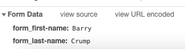

SimpleUI is an app development tool for fast product development and even faster page load times.  It uses [htmx](https://htmx.org/) on the frontend.

## Basic example



---
The core of SimpleUI is the `defcomponent` macro which expands to both:

- An ordinary function
- A rest endpoint.  Arguments are bound based on the html `name` attribute.

`defcomponent` enables developers to quickly build rich user interfaces with _no_ javascript.  All code is on the server backend and yet it feels the same as frontend code.

## Getting started

Getting started is easy with clojure tools and the excellent [kit](https://kit-clj.github.io) framework.

```bash
clojure -Ttools install com.github.seancorfield/clj-new '{:git/tag "v1.2.381"}' :as new
clojure -Tnew create :template io.github.kit-clj :name yourname/guestbook
cd guestbook
make repl
```

```clojure
(kit/sync-modules)
(kit/install-module :kit/ctmx)
```

Quit the process, `make repl` then

```clojure
(go)
```

Visit [localhost:3000](http://localhost:3000).  To reload changes

```clojure
(reset)
```

## Architecture



SimpleUI uses Hypermedia as the Engine of Application State ([HATEOAS](https://en.wikipedia.org/wiki/HATEOAS)), the web as it was originally supposed to be.  Application state is implicitly stored in the html itself, not in a separate javascript layer.  By extending the original html model instead of building a javascript layer over top, we get simplicity and **much** faster page load times.

## Handling data flow





SimpleUI maintains a call stack of nested components.  This makes it easy to label data without name clashes.  Try submitting the above form and then inspecting the browser network tab.



`(path "first-name")` and `(path "last-name")` macroexpand to unique values which are automatically mapped back to the function arguments.  We can use the `form` component multiple times on the page without worrying about a name clash.

### Components in array

To expand `(path "first-name")` and `(path "last-name")` consistently we must be careful with components inside arrays.  Use `simpleui.rt/map-indexed` to map values across an array.





## Transforming parameters to JSON

The UI provides a natural structure to nest our data.  This corresponds closely to the database schema and provides a natural connection between the two.  Try adding customers using the form below.


---


As we add customers the JSON builds up to match the UI.  We would lightly transform the data before persisting it, however it is often already close to what we want it to be.

This example uses the `add-customer` prebind to transform parameters before they are displayed (see [prebind](doc/#prebind)).

## Casting parameters


---


SimpleUI uses native html forms, so data is submitted as strings.  We can cast it as necessary.  Supported casts include **^:long**, **^:boolean** and **^:double**. See [documentation](https://github.com/whamtet/ctmx#parameter-casting) for details.

We may also cast within the body of `defcomponent`.

```clojure
[:div
  (if ^:boolean (value "grumpy")
    "Cheer up!"
    "How are you?")]
```

## Further reading

Please see the [examples](examples).



