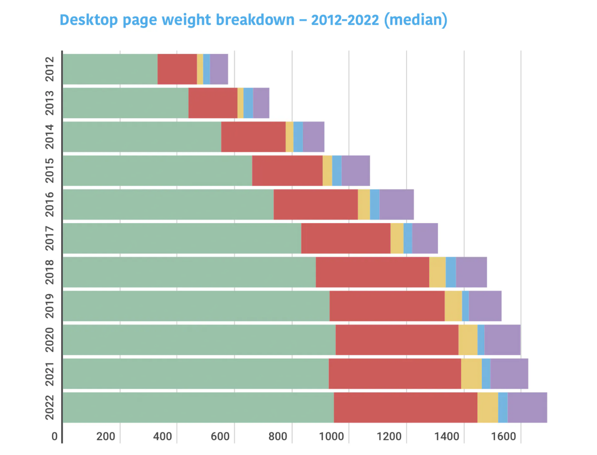

In 2020 Carson Gross released [HTMX](https://htmx.org), which takes a radically different approach to web development than other frameworks.
Instead of programming against a Javascript API, we extend the underlying HTML syntax and eliminate most of our JS.
The default pattern is that each element on the page updates itself, if you click

```html
<div hx-get="my-endpoint">Click me!</div>
```

"my-endpoint" can reply with

```html
<div>You clicked me!</div>
```

Which will replace the original div.  This lends itself naturally to the following pattern

```clojure
(defcomponent ^:endpoint my-div [req]
  (if top-level?
    [:div "You clicked me!"]
    [:div {:hx-get "my-div"} "Click me!"]))
```
We create a pseudo function that also exposes an endpoint to update state.  This deceptively simple approach eliminates a lot of the complexity in JS-oriented web development.  We no longer need

* Frontend state management e.g. redux
* Code to connect events to actions
* A frontend http client
* A backend API which is only used by a single frontend
* Javascript compilation / minification.

## Looking back at the big picture

In the early days of web development there was a clear distinction between web pages and desktop apps.  Internet speeds were limited, and the browser was used to view mostly static content.


A key milestone in the development of the web was the release of Gmail in 2004.


For the first time users could draft and receive emails entirely within the browser, tasks that had previously required a standalone desktop application.  As an internet based company, Google invested heavily to keep users within the browser.  In particular they worked on a fast new browser called Chrome which brought significant performance gains.

A key aspect of Chrome's performance was the execution of Javascript.  Javascript had been introduced into browsers all the way back in 1995, but it was initially intended as a lightweight scripting language.  Web developers included small snippets of Javascript in their web pages to display popup banners or show a live clock.  Chrome made Javascript into a proper powerhorse, fast enough that developers could write entire programs in it.  

With this increasing performance came a shift in the architecture of web programs.  HTML began to take a backseat to Javascript.  This made sense at the time as HTML is mostly a static format.  If you want a fully dynamic, desktop-like application, Javascript is where you should focus your efforts.  The transition from HTML to Javascript reached a high watermark with the growth of Facebook's React library.


React actually included a pseudo-HTML syntax called JSX which entirely compiles into Javascript.  The transition from HTML to Javascript was complete.


## The Internet grew... sort of

While these changes were taking place the world's Telcos and Internet Service Providers exponentially grew the capacity of the physical internet.


Bandwidth on a high end connection in the US grew from 16 Mbps in 2008 to 1,120 Mbps in 2023 [(source)](https://www.nngroup.com/articles/law-of-bandwidth/).  Yet in spite of these improvements in physical capacity, user experience on the web did not improve.  The growth in network capacity was offset by page bloat.



Whereas previously browsers only had to load relatively simple documents, now a user had to download an entire mini-program on every single page and every single browser tab.  The good work of internet hardware engineers was being undone.  Not only was the internet experience painful for users, developing in it became frustrating as well.  Developers suffered from 'Framework Fatigue', the constant churn of new libraries and versions made keeping up difficult and tiring.  A lot of this pain is due to the misguided emphasis on Javascript.

## There is a better way

The root cause for the switch from HTML to Javascript is that by itself HTML cannot produce dynamic content.  However instead of turning to Javascript, we can instead create our own more powerful version of HTML.  The key is to recognize that HTML is a document level format.  We can query and submit pages, but we must do so one whole page at a time.  This is the distinguishing characteristic that makes HTML clunkier and less user-friendly than traditional desktop apps.

### Local + Declarative

Instead of submitting documents at the whole page level we break our page into subsections.  Each subsection is updated independently giving it a more desktop (or SPA) like feel.  Equally importantly we do not produce updates by writing explicit code.  Instead we annotate our HTML and the HTMX runtime figures out how to generate updates.  For example if we want an autosuggestion dropdown we simply set a delay on our typing events.

```html
<input name="query" hx-get="autosuggest" hx-trigger="keyup changed delay:1s">
```

We don't have to write any explicit code, HTMX figures out how to run updates.

### SimpleUI makes HTMX Complete

With HTMX syntax we can create desktop-like apps running in the browser that don't contain explicit Javascript.  What we still lack is a means to render our apps.  SimpleUI provides us with this means through the `defcomponent` macro.

```clojure
(defcomponent ^:endpoint register-modal [req first-name last-name]
  [:form {:hx-get "register-modal"}
   [:input {:name "first-name" :value first-name}]
   [:input {:name "last-name" :value last-name}]
   [:span (format "Register as %s %s?" first-name last-name)]
   ...])
```

### Components, HTTP and functional programming fit naturally together

`defcomponent` creates a synergy between components on the page, HTTP requests and functional programming.  Each UI component contains its own state which is updated through stateless HTTP requests.  The requests map naturally onto functional programming which is also stateless.  In contrast with other frameworks we retain a clear unity between the frontend and the back.  SimpleUI is also more conservative, hewing closer to the original model of the web.

## Benefits of SimpleUI

The practical benefits of the SimpleUI approach are

* 30 - 40% reduction in frontend development time.
* 90 - 99% reduction in page load size.

The reduction in development time arises because we produce our components declaratively rather than writing imperative code.  The reduction in page load size happens because the initial page render is just plain HTML.  In even a lightweight Javascript app page size typically exceeds 100kb and often runs into the MB range.  In a SimpleUI app we only have to load about _2kb_


The reduction in page load size is particularly important for respecting user experience and channelling prospects into a sales funnel. 

## Drawbacks

So what are the drawbacks?  The most obvious is that we are now round tripping to the server for every simple UI update.  We can alleviate this slightly with a sprinkling of Javascript for very simple state changes e.g. switching tabs.  However round-tripping is less concern than you might think because of the nature of UI updates in general.  Typically when we change the UI we are either loading new content or saving changes.  In both cases a frontend app will enter into a transitionary loading state while it pends on a backend request.


Since we're waiting for the backend anyway, why not render there as well?  The limitation of backend rendering is more obvious when you have interdependencies between components on the page.  Consider a BMI calculator that requests a user's height and weight.  It is possible to draw a dependency tree between components.


A change in either height or weight triggers an update in BMI as well.  Once the number of nodes requiring an update exceeds 2 or 3 it is easier to render with Javascript directly.  In practice however, only a small percentage of apps reach this level of complexity.  The rest of us should be fine with the [hypertext approach](https://en.wikipedia.org/wiki/HATEOAS).
