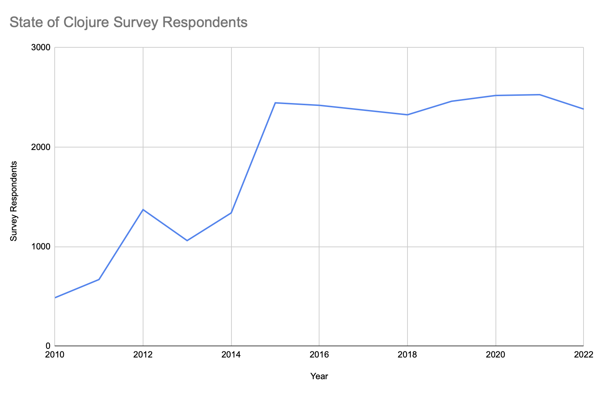

Clojure is an amazing language, but is not growing as fast as it could be. Above we see the number of respondents to the annual State of Clojure survey as a proxy of community size.  For such a unique and powerful language that is not very satisfying growth!

A key bottleneck in the growth of Clojure occurs when developers need to build a user interface.  One option is to just build using non-Clojure solutions.  You can attach a framework like React to a Clojure API, but when you do so you loose a lot of the benefit of Clojure.  At least 50% of your codebase will be in other languages.  It is less elegant to split your codebase and build pipelines across multiple technologies.

Another option is to write your frontend in Clojurescript.  There are well established frameworks available, such as [re-frame](https://github.com/Day8/re-frame), however payload size and page load times become difficult.  Production deployment of Clojurescript requires advanced compiler mode which often breaks things that aren't properly annotated.  Interfacing with non-Clojurescript frontend libraries can also be difficult.

The lack of good UI solutions is a key factor deterring growth in Clojure, but there is a solution.  Clojure has lisp macros!  We don't have restrict ourselves the same way other programming languages do.  In doing so we can build more efficient and competitive solutions.  The Clojure community can continue to grow.
